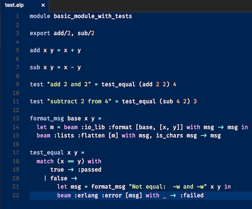

# Alpaca VSCode

Basic syntax highlighting support for Alpaca in VS Code.

## Features

Basic syntax highlight support for [Alpaca](http://alpaca-lang.org), the
ML-inspired language that runs on the Erlang VM.

## Requirements

None at present.

## Release Notes

Currently supports very basic syntax highlighting (symbols, constants, 
keywords).